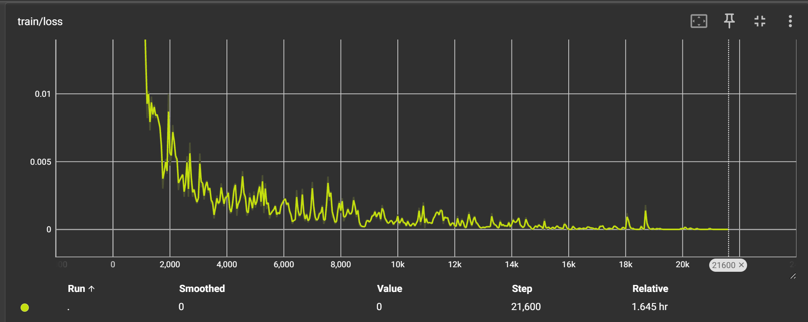
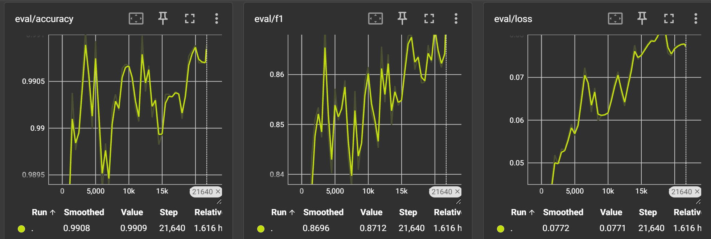
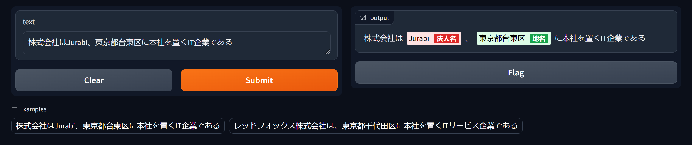
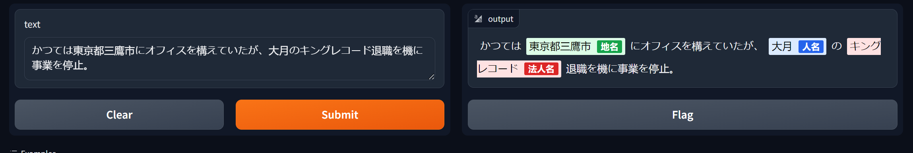

# Japanese NER Model

This project focuses on training a Named Entity Recognition (NER) model for Japanese text using PyTorch and Hugging Face's Transformers.

## Required Libraries

Make sure to install the following libraries before running the training script:

- torch
- gradio
- scikit-learn
- transformers
- unidic-lite
- fugashi
- evaluate
- tensorboard

## Training Procedure

1. **Data Preparation**:
   - All data is stored in `ner.json`.
   - Run `preprocess_data.py` to encode and tokenize the data from `ner.json`. This process will generate `ner_tagged.json` which includes the data formatted for training.

2. **Base Pretrained Model**:
   - The base pretrained model used is `"cl-tohoku/bert-base-japanese-v2"`.

3. **Label Processing**:
   - Extract labels from the data and prepend "B-" and "I-" to denote the beginning and inside of label tags, respectively.

4. **Training**:
   - The training script `training-logging-tb.py` requires the `ner_tagged.json`.
   - The script first downloads the pretrained model and then proceeds with training.
   - The model is trained for 40 epochs. Progress and metrics can be tracked in TensorBoard by saving the logs in the `log` directory.

5. **Output**:
   - The trained model is saved in the `model_v2` directory.
   - Post-training, the model is evaluated based on precision, recall, F1-score, and accuracy metrics.

6. **TensorBoard**:
   - To monitor training progress, launch TensorBoard pointing to the `logs` directory created during training.
   - to run tensorboard and see the logs simply run
        `tensorboard --logdir=./logs`
    

    <!--  -->
## Evaluation Metrics

- Precision (`eval_precision`)
- Recall (`eval_recall`)
- F1-Score (`eval_f1`)
- Accuracy (`eval_accuracy`)

## Model Evaluation

### Overview
The evaluation of the trained Japanese NER model is conducted using `eval_test.py`, which utilizes the test portion of the dataset to assess the model's performance.

### Setup
- The script assumes the presence of a `ner_tagged.json` which should already be formatted from the training phase.
- It loads the model from `./model_v2/checkpoint-18000/`, assuming the model has been saved at this location post-training.
- The evaluation is performed on a subset (20%) of the data designated as the test set.

### Running Evaluation
1. **Load Model and Tokenizer**:
   - The model and tokenizer are loaded from the specified checkpoint directory.
   - The device used for evaluation (CPU, CUDA, or MPS) is automatically detected based on availability.

2. **Prepare Test Dataset**:
   - The dataset is split into training and test sets with a 10% allocation for testing.
   - A custom PyTorch dataset class (`NERDataset`) is used to manage the data during evaluation.

3. **Metrics**:
   - Evaluation metrics are calculated using the `seqeval` scheme via the `evaluate` library.
   - The metrics computed include Precision, Recall, F1-Score, and Accuracy.

4. **Run Evaluation**:
   - The `Trainer` object from Hugging Face's Transformers library is configured with evaluation parameters and used to evaluate the model.
   - Evaluation results are printed to the console.

5. **Example Usage**:
   - Post-evaluation, the script demonstrates the model's capability by predicting entities in predefined Japanese sentences.

### Evaluation Output

The following is output at './model_v2/checkpoint-18000/'
| Metric                     | Value                  |
|----------------------------|------------------------|
| eval_loss                  | 0.04514165595173836    |
| eval_precision             | 0.9174867524602573     |
| eval_recall                | 0.9355461211887303     |
| eval_f1                    | 0.9264284349321613     |
| eval_accuracy              | 0.9946869153414406     |
| eval_runtime               | 12.0026                |
| eval_samples_per_second    | 89.064                 |
| eval_steps_per_second      | 2.833                  |

The output includes detailed metrics and entity predictions for the example sentences, helping to visually assess the model's performance.

## Web Demo

### Overview
A web demo is available to showcase the real-time capabilities of the Japanese NER model using Gradio, an open-source library that creates easy-to-use web interfaces for machine learning models.

### Setup
- The demo is set up in `web_demo.py`.
- It loads the model and tokenizer from `./model_v2/checkpoint-18000/`.

### Functionality
1. **Model Loading**:
   - The script initializes a Named Entity Recognition pipeline using the trained model and tokenizer.

2. **Entity Merging**:
   - A custom function `merge_entities` processes the output of the NER model to merge entities that are split across multiple tokens. This helps in displaying entities in a format that is easy to understand and visually appealing in the interface.

3. **Web Interface**:
   - Gradio is used to create a simple web interface where users can input sentences and see the model's predictions highlighted in the output.
   - The interface includes example sentences for quick demonstration.

4. **Launching the Demo**:
   - The demo can be started using the `demo.launch()` command, which opens the interface in the default web browser.

### Running the Web Demo
- To run the demo, execute the script using a Python environment where all required libraries (as listed in the installation section) are installed.
- Navigate to the URL provided by Gradio in the console after launching.

### Example Usage
- Users can test the model by entering their own sentences or using the provided examples to see how the model identifies and classifies entities within the text.

## How to Use
To use the web demo, simply run `python web_demo.py` from the terminal in the project directory. Ensure that you are connected to the internet and your firewall settings allow access to the required ports for Gradio.

